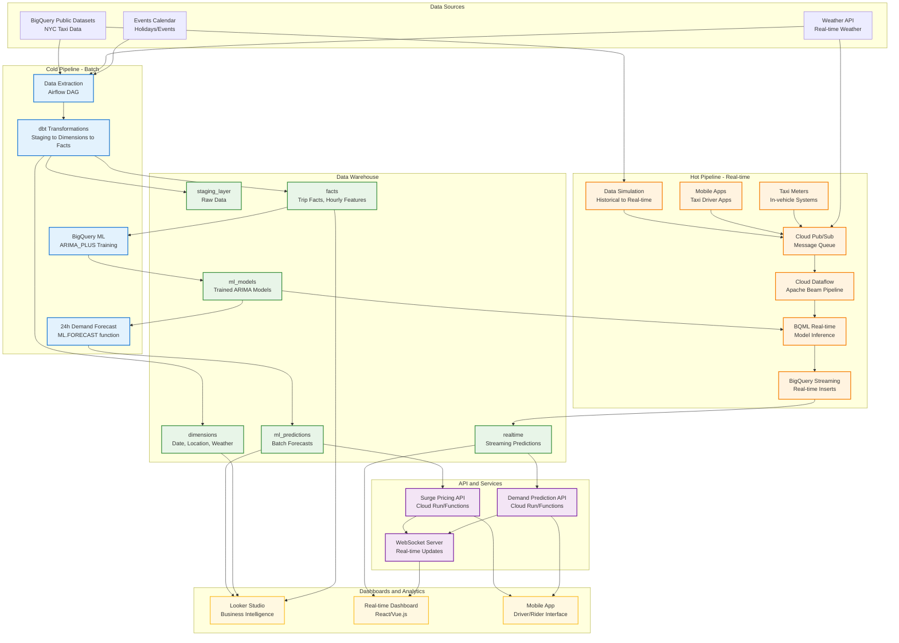

# 🚕 NYC Taxi Demand Forecasting - Architecture Overview

## 📊 System Architecture

Hệ thống được thiết kế với 2 luồng xử lý chính:
- **🧊 Cold Pipeline (Batch Processing)**: Xử lý dữ liệu lịch sử hàng ngày
- **🔥 Hot Pipeline (Stream Processing)**: Xử lý dữ liệu real-time



---

## 🧊 Cold Pipeline (Batch Processing)

### **Purpose**: Historical analysis, model training, strategic planning

### **Data Flow**:
```
NYC Taxi Public Data → Airflow DAG → dbt Transformations → BigQuery ML → 24h Forecasts
```

### **Components**:

#### **1. Data Extraction (Airflow)**
```python
# Scheduled daily at 2 AM
@dag(schedule_interval='0 2 * * *')
def nyc_taxi_cold_pipeline():
    extract_taxi_data    # Last 24h taxi trips
    extract_weather_data # Weather conditions
    extract_events_data  # Holidays, events
```

#### **2. dbt Transformations**
```sql
-- Staging Layer
models/staging/
├── stg_taxi_trips.sql      # Clean trip data
├── stg_weather.sql         # Weather normalization  
└── stg_events.sql          # Events calendar

-- Dimension Layer  
models/dimensions/
├── dim_datetime.sql        # Time dimensions
├── dim_location.sql        # H3 spatial grid
└── dim_weather.sql         # Weather dimensions

-- Facts Layer
models/facts/
├── fct_trips.sql           # Trip facts
└── fct_hourly_features.sql # ML-ready features
```

#### **3. BigQuery ML Training**
```sql
CREATE MODEL ml_models.demand_forecast_arima
OPTIONS(
  model_type='ARIMA_PLUS',
  time_series_timestamp_col='hour',
  time_series_data_col='demand',
  time_series_id_col='location_id'
) AS 
SELECT hour, location_id, trip_count as demand
FROM facts.fct_hourly_features
```

#### **4. Batch Predictions**
```sql
-- Generate 24h forecasts for all locations
CREATE TABLE ml_predictions.hourly_forecasts AS
SELECT * FROM ML.FORECAST(
  MODEL ml_models.demand_forecast_arima,
  STRUCT(24 AS horizon)
)
```

### **Outputs**:
- **📊 Business Intelligence**: Looker Studio dashboards
- **🎯 Surge Pricing**: Static surge multipliers
- **📈 Performance Metrics**: Model accuracy, demand trends

---

## 🔥 Hot Pipeline (Stream Processing)

### **Purpose**: Real-time predictions, dynamic pricing, immediate responses

### **Data Flow**:
```
NYC Taxi Public Data → Data Simulation → Pub/Sub → Dataflow → BQML Inference → BigQuery Streaming → Real-time Dashboard
```

### **Components**:

#### **1. Data Simulation (Historical to Real-time)**
```python
# Converts historical BigQuery data into real-time events
@simulate_realtime
def generate_taxi_events():
    historical_trips = extract_from_bigquery("2023-01-15")
    for trip in historical_trips:
        # Generate trip_start event
        publish_to_pubsub(create_trip_start_event(trip))
        
        # Schedule trip_end event after trip duration
        schedule_delayed_event(
            create_trip_end_event(trip),
            delay=trip.duration / speed_multiplier
        )
```

**Features:**
- **📅 Historical Data**: Extracts real NYC taxi trips from public dataset
- **⚡ Speed Control**: 30x faster than real-time (1 hour = 2 minutes)  
- **🔄 Realistic Timing**: Maintains actual trip durations and patterns
- **📊 Event Types**: Trip start/end, weather updates, traffic alerts
- **🎯 Configurable**: Different dates, trip counts, speed multipliers

#### **2. Real-time Data Sources (Future Enhancement)**
```json
// Taxi Driver Mobile App / Taxi Meter Events
{
  "event_type": "trip_start",
  "trip_id": "trip_12345",
  "driver_id": "driver_678",
  "pickup_location": {
    "lat": 40.7589,
    "lng": -73.9851
  },
  "pickup_time": "2025-11-10T14:30:00Z",
  "estimated_fare": 15.50
}

{
  "event_type": "trip_end", 
  "trip_id": "trip_12345",
  "dropoff_location": {
    "lat": 40.7505,
    "lng": -73.9934
  },
  "dropoff_time": "2025-11-10T14:45:00Z",
  "final_fare": 18.75,
  "tip_amount": 3.50
}
```

#### **2. Cloud Pub/Sub (Message Queue)**
```python
# Publisher (from mobile apps/taxi meters)
from google.cloud import pubsub_v1

publisher = pubsub_v1.PublisherClient()
topic_path = publisher.topic_path(project_id, "taxi-events")

# Publish trip events
message_data = json.dumps(trip_event).encode("utf-8")
future = publisher.publish(topic_path, message_data)
print(f"Published message ID: {future.result()}")
```

**Pub/Sub Topics**:
- `taxi-trip-events`: Trip start/end events
- `weather-updates`: Real-time weather changes  
- `traffic-alerts`: Road closures, incidents

#### **3. Cloud Dataflow (Apache Beam Pipeline)**
```python
import apache_beam as beam
from apache_beam.options.pipeline_options import PipelineOptions
from google.cloud import bigquery

class ProcessTripEvent(beam.DoFn):
    def __init__(self):
        self.bq_client = bigquery.Client()
    
    def process(self, element):
        """
        Process streaming trip events and generate real-time predictions
        """
        import json
        
        # Parse incoming event
        trip_event = json.loads(element)
        
        # Extract features for ML prediction
        features = {
            'pickup_location_id': self.get_h3_id(trip_event['pickup_location']),
            'current_hour': datetime.now().hour,
            'day_of_week': datetime.now().weekday(),
            'current_weather': self.get_current_weather(),
            'trip_event_type': trip_event['event_type']
        }
        
        # Call BQML model for real-time prediction
        if trip_event['event_type'] == 'trip_start':
            prediction = self.predict_demand(features)
            surge_multiplier = self.calculate_surge(prediction)
            
            # Prepare output for BigQuery streaming insert
            output = {
                'trip_id': trip_event['trip_id'],
                'pickup_location_id': features['pickup_location_id'],
                'event_timestamp': trip_event['pickup_time'],
                'predicted_demand_next_hour': prediction['demand'],
                'recommended_surge_multiplier': surge_multiplier,
                'current_active_trips': self.count_active_trips(),
                'processing_timestamp': datetime.now().isoformat()
            }
            
            yield output
    
    def predict_demand(self, features):
        """
        Call trained BQML model for real-time prediction
        """
        query = f"""
        SELECT predicted_total_pickups
        FROM ML.PREDICT(
            MODEL `nyc-taxi-project-477115.ml_models.timeseries_hotspot_model`,
            (
                SELECT 
                    '{features['pickup_location_id']}' as pickup_h3_id,
                    CURRENT_TIMESTAMP() as timestamp_hour,
                    0 as total_pickups  -- Dummy value for prediction
            )
        )
        """
        
        result = self.bq_client.query(query).to_dataframe()
        return {'demand': float(result['predicted_total_pickups'].iloc[0])}
    
    def calculate_surge(self, prediction):
        """
        Calculate dynamic surge multiplier based on prediction
        """
        demand = prediction['demand']
        if demand > 50:
            return 2.5
        elif demand > 30:
            return 1.8
        elif demand > 15:
            return 1.2
        else:
            return 1.0

# Dataflow Pipeline Definition
def run_pipeline():
    pipeline_options = PipelineOptions([
        '--project=nyc-taxi-project-477115',
        '--region=us-central1',
        '--runner=DataflowRunner',
        '--streaming=true',
        '--temp_location=gs://nyc-taxi-temp/temp/',
        '--staging_location=gs://nyc-taxi-temp/staging/',
    ])
    
    with beam.Pipeline(options=pipeline_options) as pipeline:
        (
            pipeline
            | 'Read from Pub/Sub' >> beam.io.ReadFromPubSub(
                topic='projects/nyc-taxi-project-477115/topics/taxi-events'
            )
            | 'Process Trip Events' >> beam.ParDo(ProcessTripEvent())
            | 'Write to BigQuery' >> beam.io.WriteToBigQuery(
                table='nyc-taxi-project-477115.realtime.trip_predictions',
                schema={
                    'fields': [
                        {'name': 'trip_id', 'type': 'STRING'},
                        {'name': 'pickup_location_id', 'type': 'STRING'},
                        {'name': 'event_timestamp', 'type': 'TIMESTAMP'},
                        {'name': 'predicted_demand_next_hour', 'type': 'FLOAT'},
                        {'name': 'recommended_surge_multiplier', 'type': 'FLOAT'},
                        {'name': 'current_active_trips', 'type': 'INTEGER'},
                        {'name': 'processing_timestamp', 'type': 'TIMESTAMP'},
                    ]
                },
                method='STREAMING_INSERTS',  # Real-time inserts
                create_disposition='CREATE_IF_NEEDED',
                write_disposition='WRITE_APPEND'
            )
        )
```

#### **4. BigQuery Streaming Inserts**
```sql
-- Real-time table schema
CREATE TABLE `nyc-taxi-project-477115.realtime.trip_predictions` (
    trip_id STRING,
    pickup_location_id STRING,
    event_timestamp TIMESTAMP,
    predicted_demand_next_hour FLOAT64,
    recommended_surge_multiplier FLOAT64,
    current_active_trips INT64,
    processing_timestamp TIMESTAMP
)
PARTITION BY DATE(event_timestamp)
CLUSTER BY pickup_location_id;

-- Real-time query for dashboard
SELECT 
    pickup_location_id,
    AVG(predicted_demand_next_hour) as avg_predicted_demand,
    AVG(recommended_surge_multiplier) as avg_surge,
    COUNT(*) as trip_events,
    MAX(processing_timestamp) as last_updated
FROM `nyc-taxi-project-477115.realtime.trip_predictions`
WHERE event_timestamp >= TIMESTAMP_SUB(CURRENT_TIMESTAMP(), INTERVAL 1 HOUR)
GROUP BY pickup_location_id
ORDER BY avg_predicted_demand DESC;
```

#### **5. Real-time Dashboard Connection**
```javascript
// Looker Studio / Custom Dashboard
// Connects directly to BigQuery streaming table

// For real-time updates, use BigQuery's streaming capability
const streamingQuery = `
    SELECT * FROM \`nyc-taxi-project-477115.realtime.trip_predictions\`
    WHERE processing_timestamp >= TIMESTAMP_SUB(CURRENT_TIMESTAMP(), INTERVAL 5 MINUTE)
    ORDER BY processing_timestamp DESC
`;

// Dashboard refreshes every 30 seconds
setInterval(() => {
    updateDemandHeatmap(streamingQuery);
    updateSurgePricing();
}, 30000);
```

### **Advantages của approach này**:

✅ **Simplicity**: Sử dụng managed services, ít infrastructure tự quản lý
✅ **Scalability**: Pub/Sub + Dataflow auto-scale theo traffic  
✅ **Cost-effective**: Chỉ trả cho những gì sử dụng
✅ **Real-time**: Latency < 10 seconds từ event đến dashboard
✅ **Integration**: Tận dụng BQML model đã train từ cold pipeline
✅ **Reliability**: Pub/Sub đảm bảo no message loss

### **Performance Characteristics**:
- **Latency**: 5-15 seconds end-to-end
- **Throughput**: 100K+ events/second (Pub/Sub limit)
- **Availability**: 99.9% (Google SLA)
- **Cost**: ~$0.40 per million messages + compute

---

## 🌐 API Layer

### **1. Surge Pricing API**
```python
# Cloud Run - Surge Pricing Service
@app.route('/api/surge/<location_id>')
def get_surge_pricing(location_id):
    # Get predictions from both pipelines
    batch_forecast = bigquery_client.query(f"""
        SELECT predicted_demand 
        FROM ml_predictions.hourly_forecasts 
        WHERE location_id = '{location_id}'
    """)
    
    realtime_demand = redis_client.get(f"demand:{location_id}")
    
    # Calculate surge multiplier
    surge = calculate_surge_multiplier(batch_forecast, realtime_demand)
    
    return {
        'location_id': location_id,
        'surge_multiplier': surge,
        'predicted_demand': batch_forecast,
        'current_demand': realtime_demand,
        'timestamp': datetime.now()
    }
```

### **2. Demand Prediction API**
```python
# Cloud Functions - Real-time Predictions
@functions_framework.http 
def get_demand_prediction(request):
    location_id = request.args.get('location_id')
    horizon = request.args.get('horizon', 1)  # hours
    
    if horizon <= 1:
        # Use hot pipeline (real-time)
        prediction = redis_client.get(f"demand:{location_id}")
    else:
        # Use cold pipeline (batch forecasts)
        prediction = bigquery_client.query(f"""
            SELECT predicted_demand
            FROM ml_predictions.hourly_forecasts
            WHERE location_id = '{location_id}' 
            AND forecast_hour = CURRENT_TIMESTAMP() + INTERVAL {horizon} HOUR
        """)
    
    return prediction
```

---

## 📈 Visualization Layer

### **1. Looker Studio (Cold Pipeline)**
**Purpose**: Business intelligence, historical analysis, strategic planning

**Dashboards**:
- **📊 Executive Dashboard**: KPIs, revenue metrics, growth trends
- **🗺️ Geographic Analysis**: Demand patterns by borough/zone
- **📈 Forecasting Dashboard**: 24h predictions, model accuracy
- **💰 Revenue Analytics**: Surge pricing effectiveness

**Data Sources**:
```sql
-- Connects to BigQuery tables
- facts.fct_trips
- ml_predictions.hourly_forecasts  
- dimensions.dim_location
- dimensions.dim_datetime
```

### **2. Real-time Dashboard (Hot Pipeline)**
**Purpose**: Operational monitoring, live decision making

**Technologies**: React.js + WebSocket + Redis

**Features**:
- **🔴 Live Demand Heatmap**: Real-time demand by location
- **⚡ Surge Pricing Monitor**: Current surge multipliers
- **🚗 Driver Distribution**: Active drivers vs demand
- **📊 Live Metrics**: Trips/minute, wait times, revenue

**Data Sources**:
```javascript
// WebSocket connection to real-time APIs
const ws = new WebSocket('wss://api.nyctaxi.com/realtime');
ws.onmessage = (event) => {
    const data = JSON.parse(event.data);
    updateDemandHeatmap(data.demand);
    updateSurgePricing(data.surge);
};
```

---

## 🚀 Deployment Architecture

### **Infrastructure**:

#### **Cold Pipeline**:
- **Orchestration**: Cloud Composer (Airflow)
- **Transformation**: dbt Cloud
- **ML Training**: BigQuery ML
- **Storage**: BigQuery (columnar)
- **Schedule**: Daily batch jobs

#### **Hot Pipeline**:
- **Ingestion**: Cloud Pub/Sub
- **Processing**: Cloud Dataflow
- **Feature Store**: Cloud Bigtable  
- **ML Inference**: Vertex AI
- **Cache**: Redis (Cloud Memorystore)
- **APIs**: Cloud Run + Cloud Functions

#### **Monitoring**:
- **Metrics**: Cloud Monitoring
- **Logging**: Cloud Logging  
- **Alerting**: Cloud Alerting
- **Tracing**: Cloud Trace

---

## 🔄 Integration Points

### **Model Synchronization**:
```python
# Daily model update process
def sync_models():
    # 1. Cold pipeline trains new ARIMA model
    cold_model = bq_client.get_model('ml_models.demand_forecast_arima')
    
    # 2. Export model to Vertex AI for real-time inference  
    vertex_model = vertex_ai.import_model(cold_model)
    
    # 3. Update real-time prediction service
    update_prediction_service(vertex_model)
```

### **Data Consistency**:
```python
# Ensure both pipelines use same feature definitions
def validate_feature_schema():
    cold_features = get_bq_schema('facts.fct_hourly_features')
    hot_features = get_bigtable_schema('realtime_features')
    
    assert cold_features == hot_features, "Schema mismatch!"
```

---

## 📋 Questions for Review

**🤔 Architecture Questions**:

1. **Model Consistency**: Có nên dùng cùng 1 model cho cả cold/hot pipeline không? Hay train 2 models riêng biệt?

2. **Feature Store**: Bigtable có phù hợp cho real-time features không? Hay nên dùng Firestore/Cloud SQL?

3. **API Rate Limiting**: Làm sao handle high traffic cho surge pricing API (có thể 1000+ requests/second)?

4. **Data Freshness**: Real-time pipeline cần độ trễ bao nhiêu? (< 1 second vs < 1 minute)

5. **Fallback Strategy**: Nếu hot pipeline fail, có fallback về cold pipeline predictions không?

**🔧 Technical Questions**:

6. **Cost Optimization**: Bigtable có cost-effective cho use case này không? Alternatives?

7. **Scaling**: Dataflow có handle được peak traffic (rush hours) không?

8. **Security**: API authentication strategy? (API keys, OAuth, service accounts?)

9. **Data Privacy**: Có cần anonymize location data không?

10. **Disaster Recovery**: Backup và recovery strategy cho cả 2 pipelines?

**📊 Business Questions**:

11. **Metrics**: Success metrics cho từng pipeline?

12. **A/B Testing**: Làm sao test surge pricing algorithms?

13. **Regulatory**: Compliance requirements cho taxi pricing?

**Bạn có muốn tôi elaborate thêm về phần nào không?** 🚀